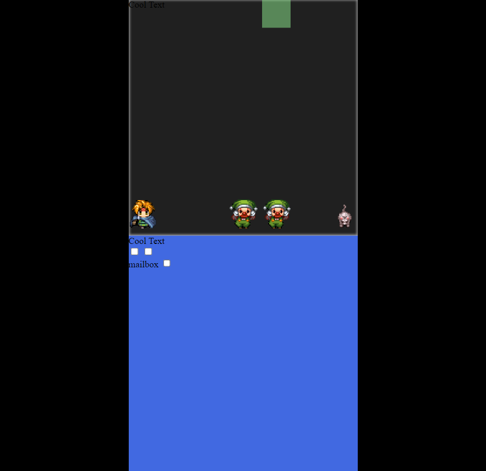

# CSS Eindopdracht

CSS features:
*  Nesting
*  Container queries
*  Property at-rules


## Log

### Day 0

Today I came up with my idea to create a claw machine. I made a 2D prototype:




I explained the architecture in [#design](#Design).

Tomorrow I will translate the design to 3D.

### Day 1

Today I made a 3D box.

`translateZ` doesn't work on the claw. Tomorrow I will try to fix this issue.

### Day 2

I experimented with 3D in codepen until I found the issue.

I found out that the problem was caused by the use of `filter` for the cabinet shadow. I would have to remove it, but I will replace it with other details.

Next time I can start working on implementing the claw movement.

### Week 1

This week I designed my idea and made a 3D box. I learned to check seemingly unrelated CSS features for problems, like `filter`.

Next week I will try to finish the claw machine and add themes.

### Day 3

I've implemented the movement from my prototype in 3D.

I've added the items. Items can be selected and hidden. I described this functionality in [#design](#Design).

### Day 4

I've added styling for the control panel and added a theme. This can be selected using a theme slider.

I've added a font that matches the theme (BPdots).

### Week 5

This week I finished the basic functionality and added a theme and typography. If I had more time, I would have added a popover, an inventory and more themes.


## Design

### Movement & selecting items

My idea for claw movement was for everything to have two animations, for x and z. These are then paused by checkboxes.

It would have been more intuitive to use :active, but I didn't find a way to detect letting go of a button.

The claw and item x movement animations look like this:

```css
@keyframes claw-move-x {
  0% {
    --x: 0;
  }
  100% {
    --x: calc(var(--body-width) - var(--size));
  }
}
```
```css
@keyframes item-cycle-x-5 {
    0% { --col: 1; }
   25% { --col: 2; }
   50% { --col: 3; }
   75% { --col: 4; }
  100% { --col: 5; }
}
```

The limitation is that this movement cannot alternate. But for this functionality is sufficient for this project.

### Hiding display items

In order to hide the display items, items must know both the column and row. My idea for this was to add up values like this:

```css
@keyframes col-5-select {
    0% { --col-add-opacity: -1; }
   25%,
  100% { --col-add-opacity: 0; }
}
@keyframes row-5-select {
    0% { --row-add-opacity: -1; }
   25%,
  100% { --row-add-opacity: 0; }
}
```

When the display item is selected, the `opacity` will be `2 - 1 - 1 = 0`.

This works because an opacity doesn't appear different when more than 1.

## Affordance

To give users more time and control, I wanted to use a checkbox to start the claw movement. However, it wasn't clear that it had to be pressed first.

To solve this, I made it look like a coin slot. This communicates that it's required to start the machine without text, because it's recognizable from real life.

## Status

Due to the glass frame, the effects of actions are immediately visible.

Additionally, I've added styling to communicate what buttons are pressed. This combined with the placement of the buttons, it naturally becomes clear what buttons have yet to be pressed.


# Sources

*  MDN
   *  https://developer.mozilla.org/en-US/docs/Web/HTML
   *  https://developer.mozilla.org/en-US/docs/Web/CSS
*  Fonts
   *  Backpacker https://backpacker.gr/fonts/7
*  Sprites
   *  RPG Maker VX Ace
   *  OpenGameArt https://opengameart.org/content/lpc-style-farm-animals
   *  https://www.hiddenone-sprites.com/